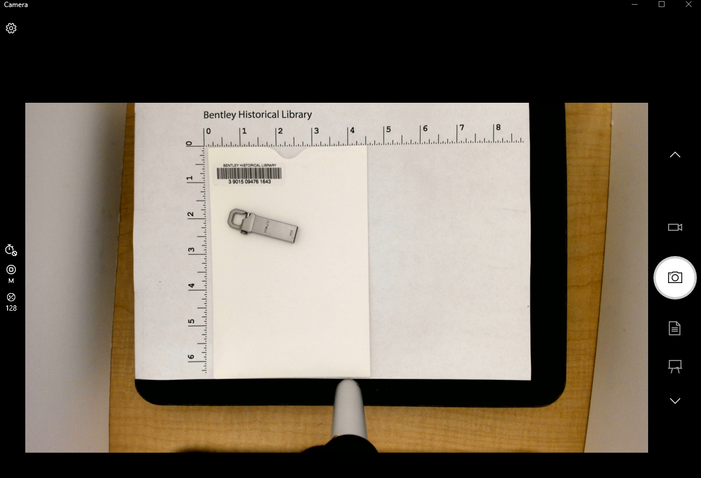
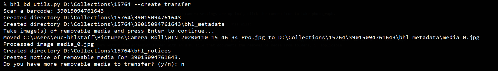

# Preliminary Procedures

## Barcodes and Accession IDs
In order to migrate content off of removable media, several preliminary steps must take place, which include creating an [accession record](https://sites.google.com/a/umich.edu/bhl-archival-curation/accessions/archivesspace-accessions) in ArchivesSpace, applying a barcode to the media's housing, and photographing the media.

> **Appraisal Note** 
>
> Material that is clearly identified as duplicate or out of scope (i.e., multiple copies of a commencement address or a motion picture from a major studio) should be separated from the collection. **Be sure to include the total number of each type of separated media on the Separation Record.**

- An [accession record](https://sites.google.com/a/umich.edu/bhl-archival-curation/accessions/archivesspace-accessions), even if minimal, must be created before removable media procedures can commence, as many of the following instructions require an accession ID. If none exists, an archivist can generate one in ArchivesSpace by clicking "Create" and then "Accession."
- Media in the collection will be housed in an envelope or case as needed and given a barcode. Barcodes are never applied to the media itself, but are placed on the housing of media. Each individual piece of media should receive a separate barcode, which will become its unique ID and will follow the digital file throughout the transfer process.
- Before starting the RMW, the network cable should be plugged in so the computer can run any necessary updates. Once the computer has booted and any updates are completed, **unplug the network cable**. In the event that any viruses or malware are among the files, this step will prevent a wider infection of the BHL network.

## Collection Setup
Once the above steps have been completed, you are ready to move forward.

- Open the Windows Command Prompt and use the [BHL Born Digital Utilities](https://github.com/bentley-historical-library/bhl_born_digital_utils) script to initiate a transfer of one or more pieces of removable media. 

`bhl_bd_utils.py [accession_number] --create_transfer`

The script will create a `D:\Collections\[accession_number]` directory, copy a `bhl_inventory.csv` template to the directory, and prompt you to scan each piece of media's barcode and to take one or more photos of the media.

## Photographing Media
Take photographs of the media using the Logitech webcam. Open the Windows Camera application to begin.

The purpose of this step is two-fold. First, it is to document anything about the removable media or its carrier that may have evidential value for researchers (e.g., handwritten notes). The second is to provide a thumbnail for our access platforms (such as this [item](https://bentley.mivideo.it.umich.edu/media/t/1_s4ho26s7) in the Bentley Digital Media Library) and the Notice of Removable Media that will be placed in the physical folder of the originating box.

>**Note**
>
>The image that you take here may show up on a public-facing website--it's important to get good image(s) of the removable media.

Tips for taking good photographs with the webcam:

- You can take more than one photo per item if necessary to capture all important information about the media (e.g., one photo of the removable media, one of the front of its carrier, one of its back, etc.), but ensure that the first image you take is "representative," i.e., that it could be used as a thumbnail in an access system.

- Make sure the camera is level and adjust when necessary. Try to move the camera as little as possible since this will impact the accuracy of Python cropping settings.

- To minimize glare, make sure the front flap of the light box is down.

- Position the media within the target to provide a scale reference and to ensure uniformity across all photos taken on the RMW. 

- Ensure that text is oriented correctly. "Bentley Historical Library" at the top of the target should be the top of the photo. 

- Larger containers, such as DVD cases, can be placed sideways on the target to ensure the entire case fits in the image. The top of the case should face the measurements on the left-hand side of the target.

- The "Auto-focus" feature should be selected. The focus can also be adjust manually if necessary.

- Make sure the barcode is visible in the first image. 

When media is positioned properly with all information showing and the camera settings are optimal, click the camera icon to take photograph.

After you have taken the photograph(s), return to the Windows Command Prompt and hit enter. This will:

- Create a folder (using the barcode number as the directory name) inside the accession folder
- Create a `bhl_metadata` subfolder that contains the photo(s) you took renamed as `media_0.jpg`, `media_1.jpg`, etc. and cropped to remove the area outside of the ruler paper
- Create a `bhl_notices` directory within the accession folder with an HTML file that documents the removal of media from folders, if applicable

The script will ask if there are more pieces of removable media to be transferred as part of the accession. Continue responding to the prompts until all pieces of media are accounted for, and then proceed to [transfer from media](transfer_from_media.md).