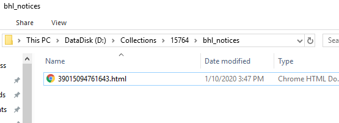
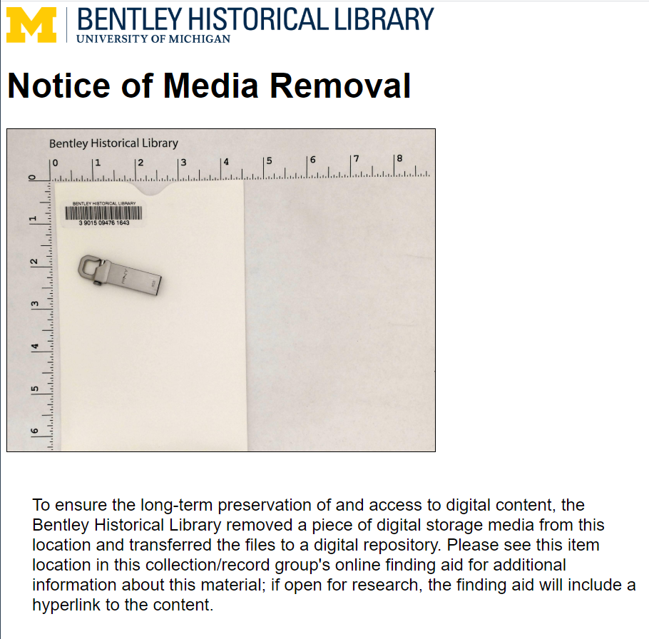

# Review Content

**Table of Contents**
- [Introduction](#introduction)
- [Reviewing Content](#reviewing-content)
- [Transfer and Appraisal Notes](#transfer-and-appraisal-notes)
- [Notice of Media Removal](#notice-of-media-removal)
- [Post-transfer Utilities](#post-transfer-utilities)

## Introduction

Once you have successfully migrated content from the original media, you may proceed to appraise the material to determine if it will be included in the Bentley's permanent collections.

> **Note**
>
> "Successful" migrations transfer content (i.e., the files and folders) from removable media **and** retain important bits of system information, such as last modified date. Many of the methods detailed below for reviewing content are intended to preserve last modified and access dates. If there are formats that require review that are not accommodated by the below procedures, consult with the Archivist for Metadata and Digital Curation

While you may need to preview some content (especially unknown content on video-formatted DVDs or audio-formatted CDs) on the original media, you should generally migrate/transfer content onto the RMW to avoid placing unnecessary stress on items (especially older floppies and Zip disks).

This high-level appraisal and review serves two purposes:

1. To determine if the content falls within the Bentley Historical Library's collecting scope and should be considered for its permanent collections.
2. To record basic information about the media and contents that will facilitate the arrangement and description of this material during [digital processing](https://sites.google.com/a/umich.edu/bhl-archival-curation/processing-archival-collections/08-digital-processing). This latter step will involve an additional review that will result in separations and/or the packaging of digital objects for deposit into the Bentley's digital repository.

## Reviewing Content

In reviewing content, Quick View Plus will be your primary tool. This application can render more than 300 unique file formats and, more importantly, will not alter the last modified times of files. If it is necessary to view vector image files (such as CorelDraw, Adobe Illustrator, or .SVG files) use Inkscape, and unique raster image file formats may be rendered with IrfanView. For viewing video-formatted DVDs, audio-formatted CDs, or audiovisual file formats, use VLC Media Player.

Do not worry about opening every file or reading through documents. This step is akin to an initial survey of paper records - you want to determine if the content has any value whatsoever and get a sense for its nature and scope.

During appraisal, you may determine that some removable media should be separated for reasons that may include:
- Commercially produced content that is not unique or appropriate for the Bentley's collecting scope.
- Duplicate content.
- Blank, corrupted, or damaged storage media.
- Content lacks sufficient informational and/or evidential value of the creators' most important functions and activities.

If a removable media item is found to have no content of value to the collection, prepend an underscore to the item's barcode directory (`_[barcode]`), mark the item as separated in the inventory (described below), include the media with the collection's separations, and be sure to include the total number of removed media on a Separation record.

## Transfer and Appraisal Notes

Information about the transfer process, the original physical media, and its contents will be recorded in a `bhl_metadata.csv` file to facilitate arrangement and description of the materials. This CSV should be stored in the transfer's root directory (i.e., the directory named after the accession number or collection ID) and will contain information about all of the removable media items included in the transfer, with one row in the CSV per barcoded item.

The template for the inventory is maintained on the `bhl_born_digital_utils` GitHub repository: https://github.com/bentley-historical-library/bhl_born_digital_utils. Refer to that repository for the latest version of the CSV and details for each of the available fields.

The `bhl_inventory.csv` will be associated with the ArchivesSpace accession record for the transfer as an External Document, will be used to automate certain quality control steps, and will be made available to the processor, so it is essential that the inventory is filled out as accurately and completely as possible.

An overview of some of the most notable fields follows.

- `accession_num`: This corresponds to the accession ID of the transfer
- `barcode`: The barcode of the individual item
- `media_type`: Whenever possible, use one of the following terms to identify the original media type: 5.25" floppy, 3.5" floppy, data CD, data DVD, audio CD, video DVD, USB, External HDD. It is particularly important to be able to distinguish audio CDs and video DVDs from other types of removable media.
`contains_pii`: `Y` or `N`. If the transferred materials obviously contain personally-identifiable information, or if a scan with bulk extractor has revealed PII, enter `Y` for this field. **Reminder**: you do not need to exhaustively review all documents, only note this if there is something obvious during your high-level review.
- `separation`: `Y` or `N`. Indicate whether or not the media was separated. If the item was separated, ensure that there is also a corresponding directory in the transfer folder of the form `_barcode`, e.g. `_39015094761643`
- `title`: Refer to the Bentley's descriptive guidelines for instructions on how to construct meaningful titles: https://sites.google.com/a/umich.edu/bhl-archival-curation/processing-archival-collections/09-description/c-aspace-archival-objects#basic
- `general_note`: An overview of the types of material on the media and the nature of the information therein (for example, ".PDF and .DOCX files with meeting agendas and minutes for Department of English Faculty meetings.")
- `processing_note`: This section allows the removable media submitter to provide additional description of the files or recommendation for the disposition of the content on the media. This field can also be used to indicate why a given piece of media was separated.

## Notice of Media Removal

The Notice of Media Removal document is a form that will be printed and placed in the physical collection where media was removed. This step does not have to be completed if the removable media was not associated with a physical folder of materials or arrived as part of a standalone digital collection. 

The notice is automatically generated by the `bhl_born_digital_utils` scripts during the preliminary procedures steps of the removable media transfer process. A `bhl_notices` folder can be found in the transfer directory containing `[barcode].html` file for each piece of removable media.

After you have safely transferred all media for a given transfer and ejected the removable media from the computer, reconnect the network cable and print the all relevant `[barcode].html` files. Insert the Notice of Media Removal in the folder where the barcoded item was located and remove the barcoded item from the collection.

Delete the `bhl_notices` directory once the above steps have been completed.

## Post-transfer Utilities

Several of the [BHL Born Digital Utilities](https://github.com/bentley-historical-library/bhl_born_digital_utils) are intended to facilitate some common post-transfer clean up and review steps. The following utilities may be run depending on the media type and content of a given transfer:

- [Check for missing barcodes and folders](https://github.com/bentley-historical-library/bhl_born_digital_utils#check-for-missing-barcodes-and-folders) to ensure that the contents of the accession directory and `bhl_inventory.csv` match. The utility will report the number of retained and separated removable media indicated by the barcode directories in the folder and in the `bhl_inventory.csv` and will report any discrepancies
- [Check for empty files and folders](https://github.com/bentley-historical-library/bhl_born_digital_utils#check-for-empty-folders-and-files) to identify potential errors with the transfer from the original removable media or signficant amounts of empty files
- [Check for and delete system files and directories](https://github.com/bentley-historical-library/bhl_born_digital_utils#check-for-and-delete-system-files-and-directories) to delete common system-generated files and directories that are not essential to preserve the content of the original media
- [Unhide folders](https://github.com/bentley-historical-library/bhl_born_digital_utils#unhide-folders) on Windows workstations (such as the Windows RMWs) to remove hidden attributes from folders to further assist in appraisal
- [Run bulk_extractor](https://github.com/bentley-historical-library/bhl_born_digital_utils#run-bulk_extractor) to scan for PII
- [Make DIPs](https://github.com/bentley-historical-library/bhl_born_digital_utils#make_dipspy) to create access .WAV and .mp4 files in batch

Once the post-transfer review for a given accession is complete, proceed to [transfer to backlog](transfer_to_backlog.md). 