# Transfer from Media

This section includes procedures for transferring content from a number of physical media types. If you don't see instructions for the media in your accession (common examples include Digital Audio Tapes [DATs] and tape drives), talk with the Archivist for Metadata and Digital Curation. Typically, we'll record [item-level extent statements](https://sites.google.com/a/umich.edu/bhl-archival-curation/processing-archival-collections/09-description/c-aspace-archival-objects#extents) (as in the [Audiovisual Extent guidelines](https://sites.google.com/a/umich.edu/bhl-archival-curation/processing-archival-collections/10-audiovisual-processing-guidelines/audiovisual-extent)) to aid our ability to inventory these items at a later date (e.g., when we obtain a reader for that type of media or identify a vendor to transfer it). For important collections, however, we may explore alternative and more immediate means of transferring content from the media.

> **Note**
>
> An essential aspect of our removable media transfer processes is to ensure that we are not altering the content from the source media. Many of the connection instructions below are written to ensure that media is mounted in read only (rather than read/write) mode.

> **Note**
>
> Some Mac-formatted removable media are labeled as such. However, you may not become aware that your removable media is Mac-formatted until you are unable to complete one one of the steps below. If that happens, proceed to the Mac-formatted Removable Media section.

> **Note**
>
> Many scenarios below describe a situation in which a piece of removable media might be separated. For any removable media that is separated, prepend the barcode directory with an underscore (e.g., `_39015094761643`) and indicate that the media was separated in the `bhl_inventory.csv`, to assist with further processing of the transfer, and be sure to include the total number of separated media for each type on the Separation Record.

## 3.5" Floppy Disks
- Connect the external 3.5" floppy disk drive to a USB port on the RMW.

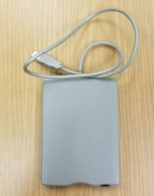

- Slide the write-protect tab on the top left side of the disk up so that both holes are open. Insert disk into drive.

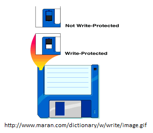

- From Start menu, select This PC. Then right click on Floppy Disk Drive (A:) and select "Scan with Windows Defender..."

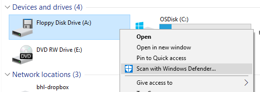

> **NOTE**: If the scan reveals any threats, eject the disk and remove to the separations. If this is a high-value collection or the disk appears to hold very significant content, remediation and content extraction may be attempted. Consult with the Archivist for Metadata and Digital Curation to determine if such steps are needed. Be sure to include the total number of separated floppy disks on the Separation Record.

- Open AccessData FTK Imager and select "Add Evidence Item" from File menu or from toolbar. In the screen that pops up, select "Logical Drive" as the Source Evidence Type. In the next screen select "A:\".

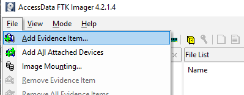

- When evidence is added, the A:\ drive will be listed under the Evidence Tree section of the FTK Imager screen. Right click on the A:\ drive and select "Export Directory Listing."

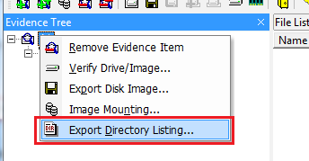

- Navigate to `D:\Collections`, select the appropriate accession and barcode directory within that folder, then select the `bhl_metadata` folder and save the file as "[barcode].manifest.csv" (i.e., as 39015094761643.manifest.csv)

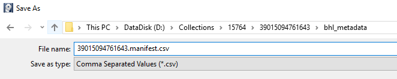

- The next step is to transfer content from the floppy disk. Content will be located in the [root] directory

- [unallocated space] refers to sections on the storage media that are not currently allocated to files by the file system. It may contain the remnants of files as well as 'slack space' (essentially left over disk space when a file does not completely fill a disk sector)

- Deleted content is indicated by an 'X' over the folder or file icon and an exclamation point at the beginning of the file name.

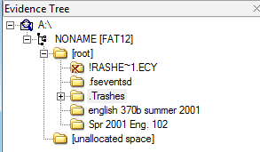

- To transfer files, right-click on the [root] directory and select "Export Files." Choose the appropriate barcode folder for the destination. The file transfer will begin and a window will provide results when the operation is complete.

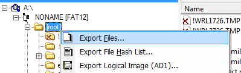

- You may now click the 'Remove Evidence Item' button and proceed to review content.

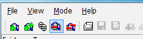

## 5.25" Floppy Disks

Transferring data from a 5.25" floppy disk requires the use of Device Side Data's FC5025 Floppy Controller and associated software.

- Insert the floppy disk into the external 5.25" disk drive and connect to the RMW.

- Because the drive will not appear in Windows Explorer, click on the 'Disk Image and Browse' icon.

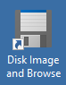

- Once the program opens, you must select the correct disk type from the drop down menu at the top of the window. This may involve some trial and error. While many of the floppies reviewed by the Bentley thus far have been MS-DOS formatted, there are a good number of options.

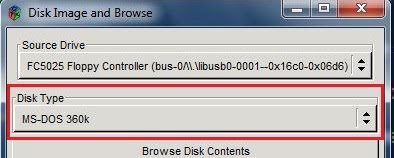

- Click the 'Browse Disk Contents' button to view any files. If you have selected the appropriate disk type, you will see a file listing in the new window that opens. If no files can be read, you may need to select a different disk type and try to browse again.

- If you have exhausted the selection of disk types and content is still unable to be read, the disk may use a unique formatting or have suffered some data loss or degradation. Eject the disk and move it to separations.

> **Note**: If you are working on a high-value collection or the disk appears to hold very significant content, notify the Archivist for Metadata and Digital Curation, as additional efforts may be warranted.

- Once you have determine that there is in fact content on the disk, click the "Capture Disk Image File" button. Enter the path to the appropriate barcode folder for the image output directory and use the barcode for the image filename. The FC5025 software will then read through the individual tracks on the disk and produce an exact copy of the data therein. If this operation fails, try again. If no disk image is able to be created, eject the disk and move it to separations.

> **Note**: If you are working on a high-value collection or the disk appears to hold very significant content, notify the Archivist for Metadata and Digital Curation, as additional efforts may be warranted.

- Your next step will be to extract files from the disk image. Open AccessData FTK Imager and select "Add Evidence Item" from File menu or from toolbar. In the screen that pops up, select "Image File" and then browse to the file you just created.

- Once the file is loaded in FTK Imager, navigate to the root directory, which will contain the folders and files that were on the original floppy disk. Export the files to the appropriate barcode folder as detailed in the 3.5" floppy instructions above.

- You may now click the 'Remove Evidence Item' button, delete the disk image file, and proceed to review content.

## Data CDs and DVDs

>**Note**
>
> When a collection contains large amounts of CDs and/or DVDs, using the RipStation may be more efficient than individually transferring content from discs using the removable media workstation.

- Insert the disc into the CD/DVD drive on the RMW. From the Start menu, select This PC. Then right click on "DVD RW Drive (E:)" and select "Scan with Windows Defender..."

> **NOTE**: If the scan reveals any threats, eject the disk and remove to separations. You may also delete the barcode folder and its contents. If this is a high-value collection or the disk appears to hold very significant content, remediation and content extraction may be attempted. Consult with the Archivist for Metadata and Digital Curation to determine if such steps are needed. Be sure to include the total number of separated optical media on the Separation Record.

- Open the DVD-RW Drive to view files on disc. Select all content, right click, and select the "Copy" option. Open the appropriate barcode folder, right-click inside, and select the "Paste" option (alternatively, drag-and-drop from the disc to the appropriate folder). TeraCopy will conduct the file transfer and verify that each file has been successfully copied.

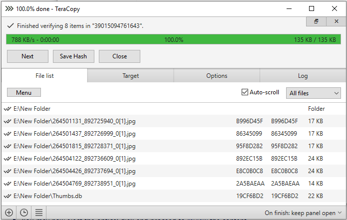

> NOTE: If TeraCopy identifies any errors with the copy operation it may be necessary to employ alternate methods to transfer the files. Contact the Archivist for Metadata and Digital Curation if it appears that important materials have not been successfully transferred.

- You may now eject the optical disc and proceed to review the content.

## Audio-Formatted CDs

- For the purposes of this manual, 'audio-formatted CDs' refer to optical media created to be used with a CD player. Archivists will need to create one uncompressed .WAV file for each track and one compressed .WAV file for the CD using a utility called Exact Audio Copy (EAC).

> **Appraisal Note**
>
> Due to the time required to rip audio-formatted CDs to uncompressed .WAV files, preview the content with VLC Media Player (if necessary) to verify that it fits within the Bentley's collecting scope and should be migrated off the original media. Be sure to include the total number of separated optical discs on the Separation Record.

> **Note**
>
> When a collection contains large amounts of CDs and/or DVDs, using the RipStation may be more efficient than individually transferring content from discs using the removable media workstation.

### Create One Uncompressed .WAV File for Each Track with EAC

- Insert the disc into the CD/DVD drive on the RMW. From the Start menu, select This PC. Then right click on "DVD RW Drive (E:)" and select "Scan with Windows Defender..."

> **NOTE**: If the scan reveals any threats, eject the disc and remove to separations. You may also delete the barcode folder and its contents. If this is a high-value collection or the disc appears to hold very significant content, remediation and content extraction may be attempted. Consult with the Archivist for Metadata and Digital Curation to determine if such steps are needed. Be sure to include the total number of separated optical discs on the Separation Record.

- Open Exact Audio Copy (EAC) (see below for configuration instructions)

- If this is a commercially-produced disc, you may reconnect to the network so that track listing and other metadata may be retrieved via online services. Go to *Database* > *Get CD Information From* > *Remote Metadata Provider*. EAC will attempt to download information and if there are multiple results, you will be prompted to double-click on the correct one to save.

- If no information on the audio CD was provided by EAC, assign a title, artist (i.e., the collection creator, unless there is a clearly identified individual or group who is responsible for the recording and/or holds copyright) and year. If applicable, you may also add a genre as well as performer (especially if others have contributed to the recording) and composer. If known, you may also add titles to the individual tracks.

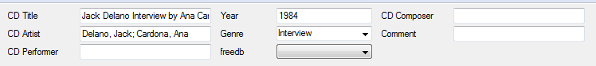

- After making sure that the check boxes next to all tracks are filled, select *Action* > *Copy Selected Tracks* > *Uncompressed*.

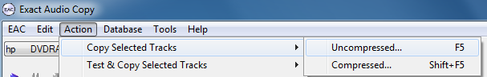

- EAC will begin copying the audio tracks, displaying progress and any errors in a window. Upon completion, you will be presented with a status report and notified of any errors. Click "OK" to proceed.

- Go to *Action* > *Create CUE Sheet* > *Multiple WAV Files With Corrected Gaps...* and save the resulting file (which will automatically be named with the CD title) alongside the WAV files and log. This CUE sheet (plain text) will contain all the metadata you entered as well as information on track listing and timing.

### Create One Compressed .WAV File for CD with EAC
This purpose of this step is to generate an access version of the audio CD for the Bentley Digital Media Library.

> Note: The below guidelines are best suited to situations in which there are only a few audio CDs. If there are multiple audio CDs, consider using the "Make DIPs" utility from the bhl_born_digital_utils to generate access WAVs in batch.

- Ensure that all tracks are checked, and go to *Action* > *Copy Range* > *Compressed*.

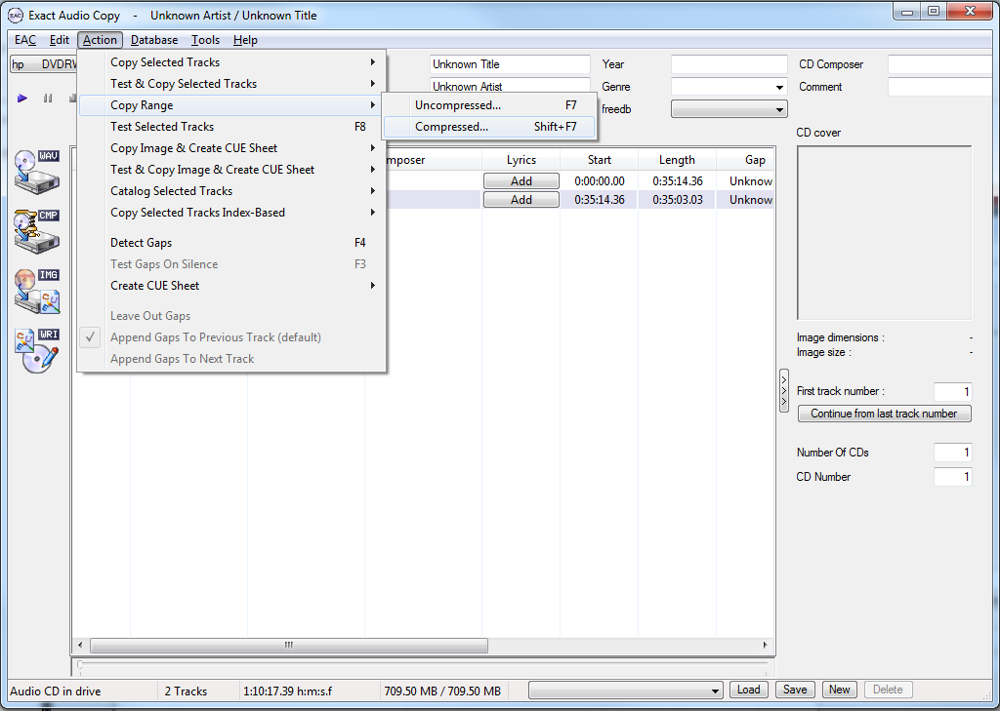

- On the "Copy Range" dialog, ensure that the start position is the beginning of the first track and the end position is the end of the last track. Click OK.

- Name the file according to the barcode, and save it to the appropriate barcode folder.

- You may now proceed to review content.

### EAC Configuration

- Go to *EAC* > *EAC Options* > *Character Replacements* and make sure that quotations marks ("), carets (^) and percent symbols (%) are replaced with nothing:

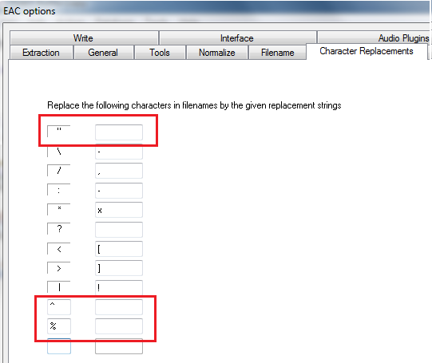

- Go to *EAC* > *EAC Options* > *Write* and disable the option to use all uppercase characters on writing: 

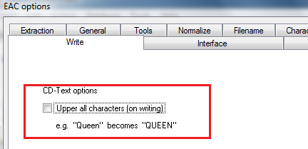

- Go to *EAC* > *EAC Options* > *Tools* and enable options to write a status report after extraction and to append a checksum to this report.

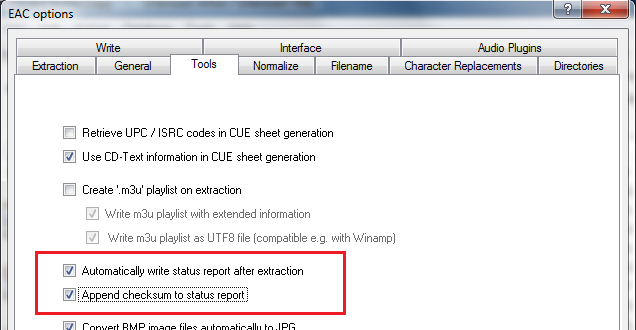

- Go to *EAC* > *Compression Options* > *Waveform* and select "Microsoft PCM Converter" for Wave Format and "44.100 kHZ, 16 Bit, Stereo" for Sample Format:

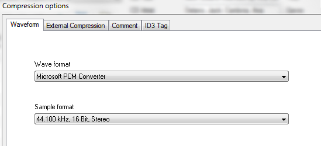

- Go to *EAC* > *Metadata Options* > *Metadata Provider* and select "freedb Metadata Plugin" from the menu. Under the options, configure EAC to "Never" search for cover images or lyrics.

- Go to *EAC* > *Metadata Options* > *freedb* and enter your (or any valid) email address.

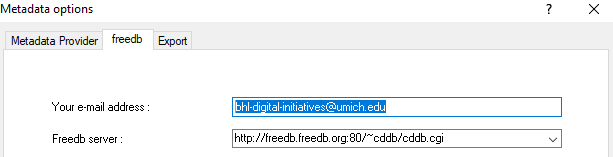

## Video-Formatted DVDs
For the purposes of this manual, 'video-formatted DVDs' refer to optical media created to be viewed with a DVD player and which contain a menu used to access one or more video objects, special features, and so forth. 

One way to recognize such media is by its AUDIO_TS and VIDEO_TS folders:

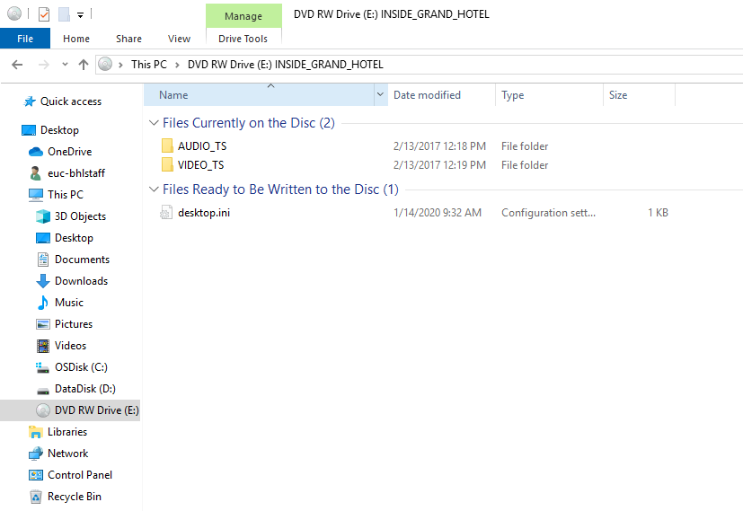

> Note
>
> When a collection contains large amounts of CDs and/or DVDs, using the RipStation may be more efficient than individually transferring content from discs using the removable media workstation.

> Appraisal Note
>
> Due to the time required to create an .ISO disk image and rip an .MP4 file, you may first review the content with VLC Media Player (if necessary) to verify that it falls within the Bentley's collecting scope and should be migrated off the original media. Be sure to include the total number of separated optical discs the Separation Record.

To ensure that we preserve the original viewing experience and any associated information as well as provide users with an accessible version of video content, we will create an .ISO disk image with FTK Imager and one or more .MP4 file(s) (access derivatives) with HandBrake.

- As a first step, insert the disc into the CD/DVD drive. From the Start menu, select This PC. Then right click on the appropriate DVD drive and select "Scan with Windows Defender..." 

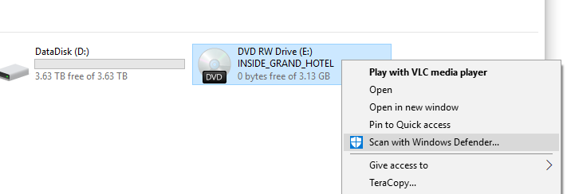

> NOTE: If scan reveals any threats, stop appraisal and migration procedures, remove media, and include disk with separations. If this is a high-value collection or the disc is reported to contain very significant content, remediation and content extraction may be attempted. Be sure to include the total number of separated optical discs the Separation Record.

### Creating an .ISO Disk Image with FTK Imager
- Open AccessData FTK Imager and select *File* > *Create Disk Image* or click the "Create Disk Image" icon on the navigation menu.

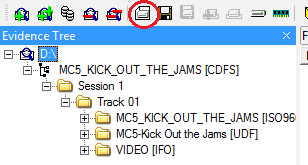

- Select "Logical Drive" as the Source Evidence Type for disk image creation and in the next screen select the CD/DVD drive (usually "E:\") from the list.

- Check the options to "Verify Images after they are created" and to "Create directory listings of all files." Then click the "Add..." button and select the appropriate barcode folder as the image destination. Use the barcode as the image file name.

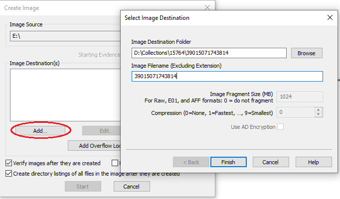

- Click Finish and then click Start. FTK Imager will track the progress of the image creation and inform you of the operation results. If image creation fails due to file system or formatting errors, it may not be possible to create an image.

> Note: FTK Imager may produce multiple segmented .ISO files (.01, .02, .03, etc.), as it imposes a 1 GB size limit per .ISO image. All of these files (and associated .CUE file) must be kept together, as they are all required to produce the exact copy of the optical disc.

### Creating .MP4 File(s) with HandBrake
> Note: The below guidelines are best suited to situations in which there are only a few video DVDs. If there are multiple video DVDs, consider using the "Make DIPs" utility from the bhl_born_digital_utils to generate .mp4s in batch.

- Open HandBrake. In the Source Selection screen, click "Cancel." We want to update some settings before adding a source to avoid potential complications.

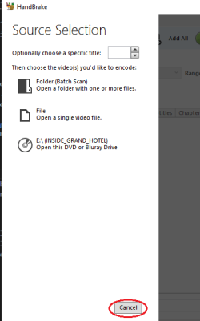

- On the following screen, check to make sure the following are selected: (1) the "BHL mp4" preset and (2) "MP4" as format.

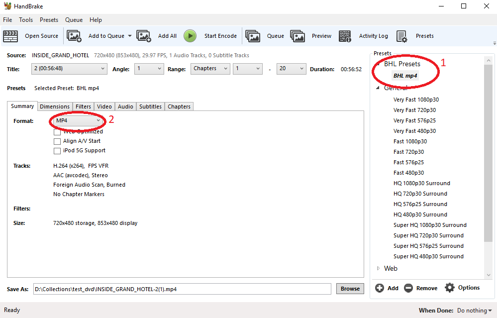

- Go to *Tools* > *Preferences* and select the "Output Files" menu. Enable "Automatically name output files" and browse to the appropriate barcode folder for the default path. Under "File Format" enter {source}-{title} and make sure the "Always use MP4" option is selected. 

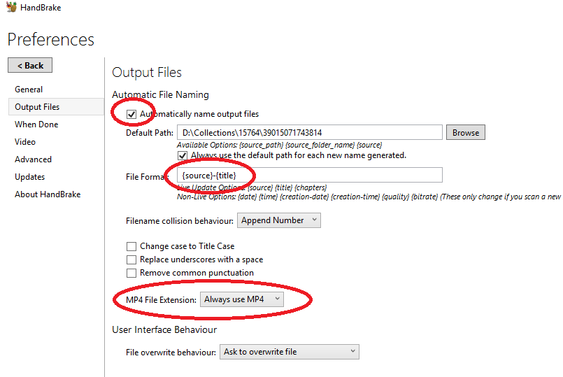

> Note
>
> If you're working with a non-commercial DVD and, as a result, "Automatically name output files" results in a non-unique default name to your MP4 file, change the name to the item's barcode, e.g., "File Format: 39015094760579" (without the {source} or {title}).
>
> If you're working with a non-commercial DVD (as above) and it has multiple tracks, change the name to the item's barcode followed by the title, e.g., "Format: 39015094760579-{title}" (without the {source}).

- Click "Back" to return to the main screen and then click the "Open Source" button in the toolbar and select the "E:\" drive. HandBrake will scan the disc. The "Title" drop down will show if there is more than one title on the disc.

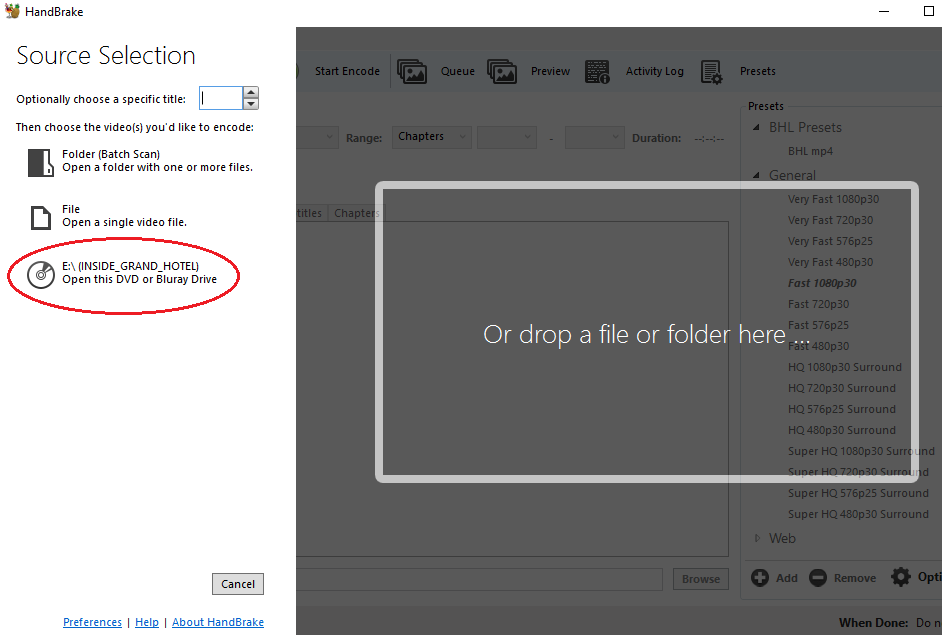

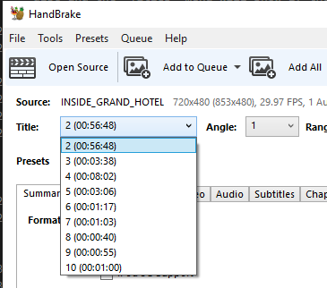

- Click "Add to Queue" or, if there are multiple titles on the disc, click "Add All"

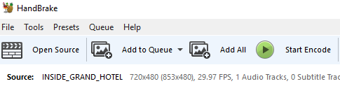

- Click "Start Encode". HandBrake will go through the queue and provide progress information near the bottom of the window. It may take a relatively long period of time for the conversion process to complete. It may be necessary to adjust the power settings on your work station so that it will not sleep.

- After completing the above steps, you may conduct a more thorough review to record any information about the contents.

## USB Drives
- Press the power button to turn on the Tableau UltraBay 4 and insert the USB drive into the USB 3.0 port on the UltraBay.

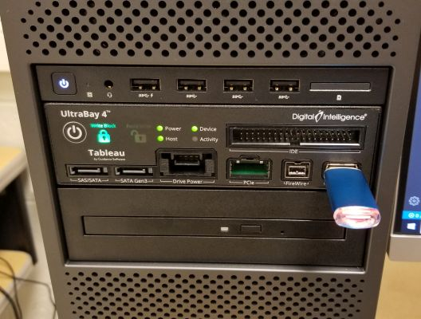

- From the Start menu, select This PC, then right click on the appropriate drive and select "Scan with Windows Defender...".

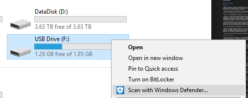

> NOTE: If scan reveals any threats, stop appraisal and migration procedures, remove media, and include disk with separations. If this is a high-value collection or the USB drive is reported to contain very significant content, remediation and content extraction may be attempted. Be sure to include the total number of separated optical discs the Separation Record.

- Open the drive. Transfer files using TeraCopy (the default copy handler on the RMWs): highlight and copy content and then paste into the appropriate barcode folder or drag-and-drop from the drive to the appropriate barcode folder.

- To remove the USB drive, click on the "Safely Remove Hardware and Eject Media" icon at the bottom right of the Windows toolbar and select "Eject T356789iu". You are now ready to review the content.

## Secure Digital (SD) Cards
- Attach the UltraBlock Forensic Card Reader to a USB port on the RMW.

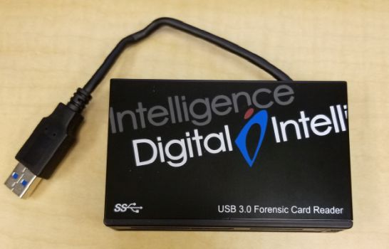

- The card reader supports a number of different formats, including Compact Flash Card (CFC), MicroDrive (MD), Memory Stick Card (MSC), Memory Stick Pro (MSP),Memory Stick Pro Duo (MSPD), Smart Media Card (SMC), xD Card (xD), Secure Digital Card (SDC, SDHC and SDXC), MicroSD, and MultiMedia Card (MMC).

- Insert the card into the appropriate slot.

- From the Start menu, select This PC, right click on the appropriate drive and select "Scan with Windows Defender..."

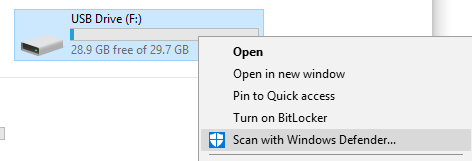

> NOTE: If the scan reveals any threats, stop appraisal and migration procedures, remove media, and include the card with separations. If this is a high-value collection or the card is reported to contain very significant content, remediation and content extraction may be attempted. Be sure to include the total number of separated cards on the Separation Record.

- You may now proceed to copy folders/files to the appropriate barcode directory with Teracopy (as with USB drives above). Review content when copy operation is complete.

## Zip Disks
- Turn on the Tableau UltraBay 4 and attach an external Zip disk drive into the USB 3.0 port on the drive. Insert the Zip disk into the drive.

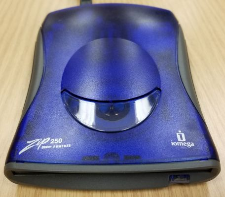

- From the Start menu, select This PC, right click on the appropriate drive, and select "Scan with Windows Defender..."

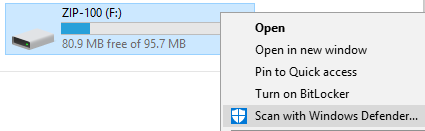
> NOTE: If the scan reveals any threats, stop appraisal and migration procedures, remove media, and include Zip disk with separations. If this is a high-value collection or the Zip disk is reported to contain very significant content, remediation and content extraction may be attempted. Be sure to include the total number of separated Zip disks on the Separation Record.

- You may now proceed to copy folders/files to the appropriate barcode directory with Teracopy (as with USB drives above). Review content when copy operation is complete.

> Note: When finishing copying, it may be necessary to plug the Zip disk drive into one of the non-UltraBay USB ports to supply enough power to eject the disk. **Be very careful as connecting the drive to a non-UltraBay port will disable write blocking**

## HFS or HFS Plus (Mac-Formatted) File Systems
The Bentley has a Mac Removable Media Workstation. Instructions for using that machine are forthcoming. In the meantime, transfer content similarly to the above by connecting the external Tableau T8-R2 Forensic USB Bridge to the Mac and then connecting the removable media device to the USB bridge. Content the Archivist for Metadata and Digital Curation for additional assistance. 

