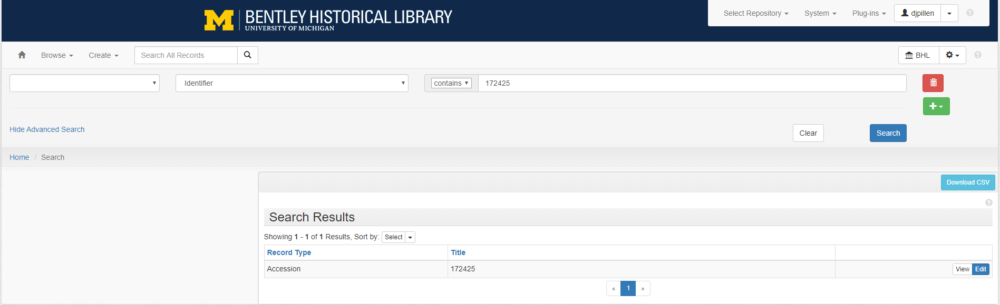

# Transfer to Backlog
When an accession includes digital content (whether transferred from removable media or via some other means), it is transferred to Archivematica's backlog (or, in some cases, the Bentley's digital storage backlog) in one or more transfers. 

In Archivematica, a transfer begins the process of transforming any set of digital objects and/or directories into a SIP. Once uploaded to the dashboard, transfers in the Transfer tab run through several micro-services, including:

- UUID assignment
- checksum verification (if checksums are present)
- package extraction (i.e., unzipping of zipped or otherwise - packaged files)
- virus checking
- indexing
- format identification and validation
- metadata extraction

Transfers are then sent to a managed backlog for storage until they are ready to be retrieved and processed at a later date. They are also noted in the accession record.

## Transferring from the RMW
The first step in transferring content into the Bentley's backlog is to transfer the content from one of the RMWs to the Bentley's remote digital archival storage (aka the bhl-digitalarchive or R drive).

- Connect to the R drive using the bhl-digitalarchive.bat program (you'll need to have reconnected the ethernet cable to the RMW)

- Enter your U-M username and password. This will mount the drive on the RMWs "R:" drive.

> Note
>
> If you do not have permission to access the bhl-digitalarchive, notify the Archivist for Metadata and Digital Curation

## Copying from the RMW
Use the [BHL Born Digital Utilities' copy utility](https://github.com/bentley-historical-library/bhl_born_digital_utils#copy-accession-from-rmw) to copy a given transfer from the RMW to the bhl-digitalarchive

`bhl_bd_utils.py ACCESSION_NUM --copy`

This will use robocopy on the RMW to securely transfer the content.

> Note
>
> If robocopy reports that any content was not able to be transferred, consult with the Archivist for Metadata and Digital Curation

## Cleaning Up the RMW
- Once you have successfully transferred an accession from the RMW to the R: drive, you may delete the `D:\Collections\[accession]` directory.
- [Disconnect](http://www.wikihow.com/Disconnect-a-Mapped-Network-Drive) the bhl-digitalarchive

## Pre-backlog Transfer Review
> Note
>
> The following steps will be completed by the Archivist for Metadata and Digital Curation

- Review the transfer in the bhl-digitalarchive, including reviewing the `bhl_metadata.csv` for accuracy and completeness, reviewing any appraisal decisions (i.e., separations), and running a few additional BHL Born Digital Utilities
- Move any separations from the accession directory to the dedicated `separations` directory on the R: drive.
- If a transfer contains significant amounts of audiovisual media (audio CDs or video DVDs) in addition to non-audiovisual data (floppies, USB drives, and so on), run the [BHL Born Digital Utilities' Separate AV media](https://github.com/bentley-historical-library/bhl_born_digital_utils#separate-av-media) utility to move audiovisual content into its own directory to facilitate moving content to the appropriate backlog location
- Rename the `bhl_inventory.csv` to `[accession_number]_bhl_inventory.csv` and move it to `R:\Born-Digital Processing\bhl_inventories`
- Once all separations, AV media, and the bhl_inventory.csv have been moved and the transfer is ready to be sent to backlog, [bag](https://tools.ietf.org/html/draft-kunze-bagit-12) the transfer
- Determine whether a given transfer should be transferred into Archivematica's backlog or the `R:\Backlog` directory. Larger transfers, those that are relatively homogenous in nature, those that contain significant amounts of audiovisual content, and those that contain a significant amount of existing arrangement and description (e.g., well-defined directory structure and file naming conventions) are good candidates for storing in `R:\Backlog` as the Archivematica Appraisal tab will be of limited utility. On the other hand, smaller transfers, those that are relatively heterogenous in nature, and those that contain no readily identifiable or reusable arrangement and description are good candidates for transferring into Archivematica's backlog for further appraisal.

## Transfer to R:\Backlog
If a given accession should be transferred into the `R:\Backlog` directory, simply move the bagged accession directory from `R:\Born-Digital Processing` to `R:\Backlog`

## Transfer to Archivematica's backlog
- Move the bagged accession directory from `R:\Born-Digital Processing` to `R:\Backlog\born_digital_processing_transfer`
- In the Archivematica dashboard, select the appropriate transfer type from the drop down menu. Typically, this will be the "Unzipped bag" option, though we will occasionally use the "Standard" type
- For "Transfer name," use the name of the top directory. Typically, this is the Accession ID, although when an accession has been broken up into multiple transfers, it will be the Accession ID with a three-digit sequential suffix (e.g., _001, _002, _003, etc.) appended to it.
- For "Accession no." use the Accession ID from ArchivesSpace. When an accession has been broken up into multiple transfers, use the Accession ID as the "Accession no." for all transfers.
- Click "Browse" and choose the Transfer Source location. Typically, this will be "BHL Digital Archive Backlog Born Digital Processing Transfer." Select the source directory containing your object(s) for upload, and click "Add."
- Ensure that the "Approve automatically" box is checked and click the "Start transfer" button
- The transfer will now run through a series of micro-services set by the Archivist for Metadata and Digital Curation in the Administration tab before it is deposited into a managed backlog.

### Cleaning up the transfer source location
After an accession has been successfully transferred into Archivematica's backlog, move the transfer directory to `R:\Backlog\Done_transferred_AM_backlog`. This helps to ensure that the transfer source location remains clear of already-transferred materials. The Archivist for Metadata and Digital Curation will delete materials from the `Done_transferred_AM_backlog` from time to time.

## Tracking Transfer in ArchivesSpace
It is essential to be able to track the location of transferred materials in the backlog in the Bentley's collection management system, ArchivesSpace. This information will be referenced by the processing archivist to locate the materials and proceed with digital processing.

- In ArchivesSpace, select "Identifier" from the advanced search drop down menu, search using the accession number, and select the appropriate result.

Edit the accession record and fill out the following fields:
- Edit the Content Description according to the guidelines for [basic information](https://sites.google.com/a/umich.edu/bhl-archival-curation/accessions/archivesspace-accessions#info). Note that the removable media have been transferred and update the content description with any salient information from the bhl_inventory.csv
- Create an extent statement for the digital content using the [guidelines for creating extents](https://sites.google.com/a/umich.edu/bhl-archival-curation/accessions/archivesspace-accessions#extents)
- Create and link a Digital Object instance for the transfer according to the [guidelines for creating and linking digital object instances](https://sites.google.com/a/umich.edu/bhl-archival-curation/accessions/archivesspace-accessions#digiobjs). For materials transferred to `R:\Backlog`, the title will be "Transfer" and the identifier will be the path to the transfer (e.g., `R:\Backlog\172425`). For materials transferred into Archivematica's backlog, the title will be "Archivematica transfer" and the identifier will be the Archivematica transfer UUID.
- Add the `bhl_inventory.csv` as an External Document, giving the External Document a title of "BHL inventory" and a Location containing the path to the inventory on the R: drive (e.g., `R:\Born-Digital Processing\bhl_inventories\172425_bhl_inventory.csv`)

