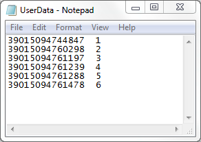
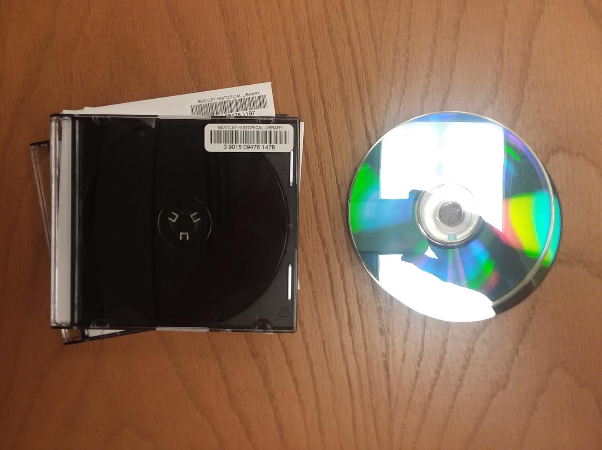
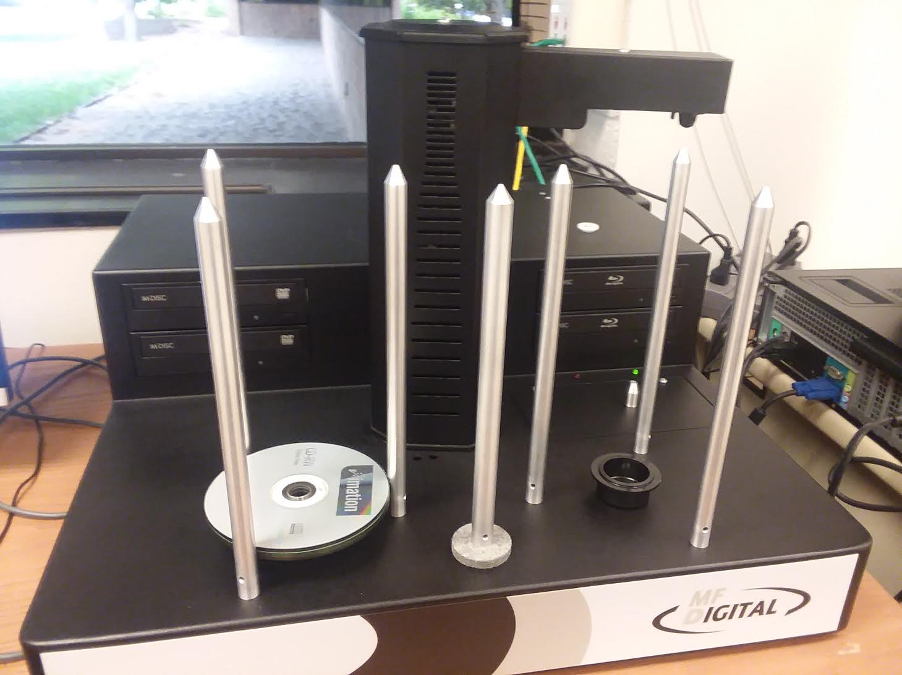
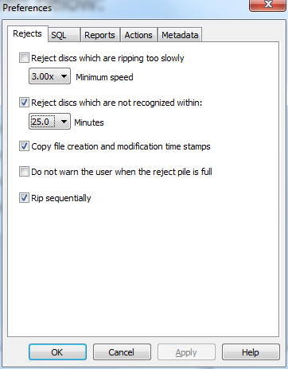
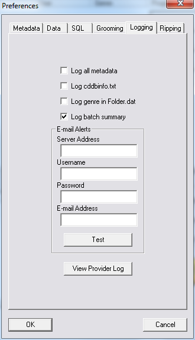
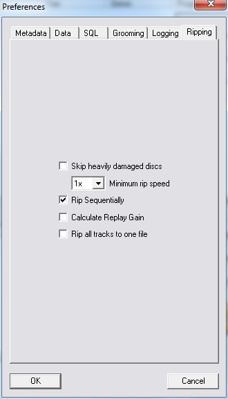
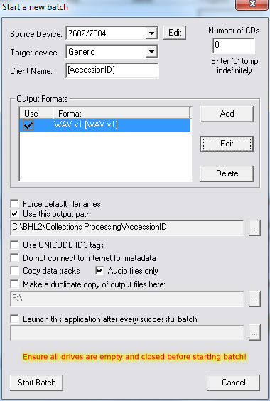
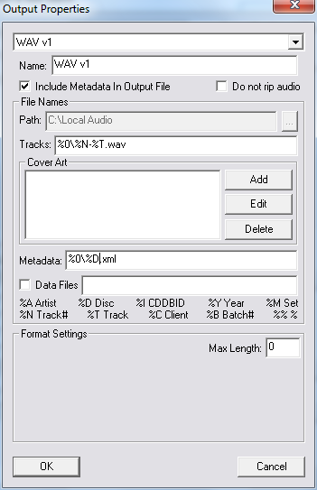
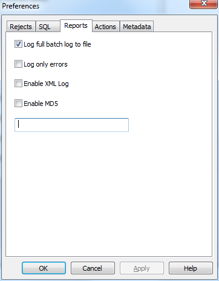

# Using the RipStation
The [RipStation](http://www.mfdigital.com/ripstation.html) allows you to automate the transfer of content off of large batches of optical media. When a collection contains large amounts of CDs and/or DVDs, using the RipStation may be more efficient than individually transferring content from discs using the removable media workstation. Consult with the Archivist for Metadata Digital Curation when processing collections with large amounts of optical media (i.e. CDs and DVDs).

The RipStation requires the use of different software based on the content stored on the optical discs. For data CDs and DVDs, the DataGrabber program is used. For audio-formatted discs, the RipStation program is used. For video-formatted discs, the MediaGrabber program is used. See the following workflow for further instruction.

**Table of Contents**
- [Preliminary Procedures](#preliminary-procedures)
- [Working with Data CDs and DVDs](#working-with-data-cds-and-dvds)
- [Working with Audio-formatted CDs](#working-with-audio-formatted-cds)
- [Working with Video-formatted DVDs](#working-with-video-formatted-dvds)
- [Finishing Up](#finishing-up)
- [Troubleshooting](#troubleshooting)

## Preliminary Procedures

These instructions assume that all AutoPlay defaults are set to "Take no action" and that the following programs are installed:
1. FFmpeg
2. HandBrake CLI
3. VLC Media Player

- A metadata spreadsheet must be created before a project can begin. Consult with the Archivist for Metadata and Digital Curation if necessary.

- Apply a barcode to each disc's case and write the last four digits on the plastic core of the disc in permanent marker. This will help match the disc with its original case once the RipStation is finished.

> **Note**
>
> Barcodes are never applied to the disc itself, but on the envelope or the case. Each individual piece of media should receive a separate barcode.

- In order to use the RipStation, you must divide optical discs into one of three categories:
  1. Data CDs and DVDs (these may include audio and/or video content but will not be formatted for these specific content types, i.e. including menus or track lists)
  2. Audio-formatted CDs
  3. Video-formatted DVDs

- Update the UserData.txt file located in the directory of the program you will use for transfer. This will allow the program to generate filenames using the barcode.
  - Navigate to the appropriate UserData.txt file
    - For video-formatted DVDs: `C:\Program Files\MF Digital\Ripstation MediaGrabber`
    - For audio-formatted CDs: `C:\Program Files\MF Digital\Ripstation`
    - For data CDs and DVDs: `C:\Program Files\MF Digital\Ripstation DataGrabber`
  - Scan the barcode (and remove the resultant carriage return). Press "Tab."
  - Enter the sequential number (e.g., 1, 2, 3, etc.). Press "Enter" so that there is one disc entry per row.

  - Take each disc out of its envelope or case and place it face down. The first disc must be at the top of the pile in the spindle.
  - Place the envelope or case right-side up. The first case should be at the bottom of the pile.

  - Repeat steps as needed, creating an upside-down pile of discs and a rightside-up pile of cases.
  - Save the file (overwriting any existing UserData.txt file)
  - Flip over the stack of discs so that the first discs is at the top facing upwards.
  - Place the discs on the spindle (either the right or the left spindle)

## Working with Data CDs and DVDs
- If needed, the factory instructions for DataGrabber are located at [insert_path]
- Open the DataGrabber application. 
- Click the "Preferences" icon 
- Under the "Rejects" tab:
  - Set "Reject discs which are not recognized within:" to 2.5 minutes
  - Check "Copy file creation and modification time stamps"
  - Check "Rip sequentially"

- Under the "Reports tab:
  - Ensure that full batch logs are logged to file
- On the right side of the DataGrabber window, select the loader type:
  - MFD
  - Advanced
- Select an output format:
  - Files
- Enter the disc count:
  - The total number of discs entered in the UserData.txt file.
- Choose the root path and name format (using the accession ID):
  - `D:\Collections Processing\[AccessionID]\`
  - `%0\`
- Click the "Start" icon
- Once the RipStation finishes, you should have a directory for each barcode with the files from the disc inside.

## Working with Audio-formatted CDs
- If needed, the factory instructions for RipStation are located at [insert_path]
- Open the RipStation application
- Click the "Preferences" icon
- Under the "Logging" tab, ensure that "Log batch summary" is checked.

- Under the "Ripping" tab, ensure that "Rip sequentially" is checked.

- Click the "New Batch" icon 
- Set 7602/7604 as the source device
- Target device should be “Generic”
- Client Name should be [AccessionID]
- Enter the disc count (can be found in the UserData.txt file you created)
- Output format should be WAV v1 [WAV v1]
- Output path should be D:\Collections Processing\[AccessionID] (using the appropriate accession ID)
- Audio files only are ripped

- Click "Edit" under "Output Formats" while `WAV v1 [WAV v1]` is selected and ensure that it is named WAV v1, that "Include Metadata In Output File" is checked, that tracks are named %0\%N-%T.wav and that metadata is named %0\%D.xml

- Click "Start Batch"
- Once the RipStation finishes, you should have a directory for each barcode with WAV files inside.

## Working with Video-formatted DVDs
- If needed, the factory instructions for MediaGrabber are located at: [insert_path]
- Open the MediaGrabber application
- Click the "Preferences" icon 
- Under the "Rejects" tab:
  - Set "Reject discs which are not recognized with:" to 2.5 minutes
  - Check "Copy file creation and modification time stamps"
  - Check "Rip sequentially"

- Under the "Reports" tab, ensure that "Log full batch log to file" is checked

- Select the load type on the right-hand side of the window:
  - MFD
  - Advanced
- Select an output format
  - ISO/MDF Image
- Enter the disc count, which can be found in the UserData.txt file
- Choose root path and name format using the accession ID:
  - `D:\Collections Processing\[AccessionID]\`
  - %0\%0
- Click the "Start" icon
- nce the RipStation finishes, you should have a directory for each barcode with a disc image and an MP4 inside.

## Finishing Up
- Remove the discs from the spindle
- Place the discs back in their original cases. They should be in the correct order, so that the disc on the top corresponds to the case or envelope on the top. If there are any issues, use the last four digits of the barcode written on the inner ring of the disc to match discs to cases
- Confirm that a folder exists for each disc. If any discs failed, see troubleshooting below.
- Scan transferred content for viruses by right clicking on the accession folder and selecting "Scan with System Center Endpoint Protection"
- Additional post-processing work will be required before content is transferred to Archivematica's backlog. Consult with the Archivist for Metadata and Digital Curation for further instruction is necessary.
- Because the RipStation can no longer be connected to the Internet, copy the accession directory to an external hard drive and then transfer the content to backlog using one of the Removable Media Workstations, following the standard [transfer to backlog](transfer_to_backlog.md) procedures

## Troubleshooting
- Often, you will end up with some discs that failed to transfer. They will be placed in the error pile.
- In this case, open the log file located at `D:\Collections Processing\[AccessionID]\Log.txt` (or, for audio-formatted CDs, `D:\Collections Processing\[AccessionID]\[AccessionID]\Log.txt`)
  - To identify discs that did not rip, look for lines that begin with "Failed to rip disc [Barcode]"
  - The log will occasionally include other helpful information about why a disc failed to rip
-  Remove the discs from the error pile spindle and set aside. Indicate in the `bhl_metadata.csv` spreadsheet which discs failed to rip on the RipStation.
- Attempt to transfer these discs one-by-one using the standard [transfer procedures](transfer_from_media.md)
- If the transfer is still unsuccessful on the RMW, indicate in the metadata spreadsheet which discs failed to transfer on both the RipStation and RWM. Then, delete the corresponding barcode folder and its contents from the transfer folder.
- Include the failed transfer with separations. Consult with the relevant field or processing archivist or the Archivist for Metadata and Digital Curation if necessary.
